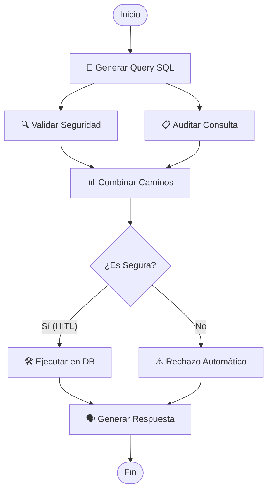

# Agente SQL con LangGraph (Paralelización & Human-in-the-Loop)

Este repositorio contiene la implementación de un Agente de Inteligencia Artificial especializado en la consulta e interacción con bases de datos relacionales (SQLite) utilizando **LangGraph**, **LangChain** y **Azure OpenAI**.

El agente está diseñado bajo una arquitectura de flujo robusta que incorpora **ejecución en paralelo** para tareas de validación/auditoría y control interactivo **Human-in-the-Loop (HITL)** para la confirmación de operaciones antes de interactuar con la base de datos.

---

## 🗺️ Arquitectura del Grafo

El flujo de ejecución del agente sigue un Grafo Acíclico Dirigido (DAG) diseñado con LangGraph:



---

## 🛠️ Características Clave

### 1. ⚡ Paralelización Nativa
Una vez que el nodo `generar_query` produce una consulta SQL, LangGraph bifurca el flujo en **dos ramas paralelas concurrentes**:
*   **Rama de Seguridad (`validar_seguridad`)**: Ejecuta una validación local rápida en Python buscando comandos destructivos o no permitidos (`DROP`, `DELETE`, `UPDATE`, `INSERT`, etc.).
*   **Rama de Auditoría (`auditar_query`)**: Invoca de manera paralela la API de Azure OpenAI para generar un resumen técnico explicativo sobre qué hace la consulta en la tabla.
*   **Nodo Combinar**: Actúa como barrera de sincronización, esperando que ambos hilos terminen y consolidando la información en el estado del agente antes de avanzar.

### 2. 👤 Human-in-the-Loop (HITL)
El grafo está compilado con un checkpointer en memoria (`MemorySaver`) que congela la ejecución **antes** del nodo `ejecutar_db`. En la consola interactiva, el usuario tiene tres opciones sobre la consulta propuesta:
1.  **Aprobar (Enter / 's')**: El grafo continúa, ejecuta la consulta SQL exacta y devuelve los resultados.
2.  **Modificar (Escribir una query SQL custom)**: Permite corregir la consulta. El sistema actualiza el estado y ejecuta la nueva versión modificada.
3.  **Rechazar ('n' / 'rechazar')**: Cancela la consulta. Se salta el nodo de base de datos inyectando un estado de cancelación y el agente responde de manera amigable explicando que se canceló la operación.

---

## 🚀 Instalación y Configuración

### Prerrequisitos
*   Python 3.10 o superior
*   Credenciales de acceso a un servicio de Azure OpenAI (o en su defecto OpenAI estándar)

### Paso 1: Clonar el Repositorio
```bash
git clone https://github.com/Mariioogrciia/langraph.git
cd langraph
```

### Paso 2: Crear y Activar el Entorno Virtual
En Windows (PowerShell):
```powershell
python -m venv .venv
.\.venv\Scripts\Activate.ps1
```

En macOS/Linux:
```bash
python3 -m venv .venv
source .venv/bin/activate
```

### Paso 3: Instalar Dependencias
```bash
pip install -r requirements.txt
```

### Paso 4: Configurar Variables de Entorno
Crea un archivo `.env` en la raíz del proyecto con tus credenciales de Azure OpenAI:
```env
AZURE_OPENAI_API_KEY="tu_clave_api_aqui"
AZURE_OPENAI_ENDPOINT="https://nombre-del-recurso.openai.azure.com/"
```
*Nota: El script utiliza la versión de API `2024-02-15-preview` y la implementación `gpt-4o-mini` por defecto, que son cargadas automáticamente.*

---

## 💻 Instrucciones de Uso

### Ejecutar el Agente de Chat Interactivo
Asegúrate de tener el entorno virtual activo y ejecuta:
```bash
python agente.py
```

#### Ejemplo de Interacción (Aprobación):
```text
👤 Tú: Dame los productos con precio mayor a 1000
----------------------------------------
🧠 [Nodo: Agente AI] Generando la Query SQL...
📋 [Nodo Paralelo: Auditoría] Analizando la consulta: SELECT * FROM productos WHERE precio > 1000;
🔍 [Nodo Paralelo: Seguridad] Validando la consulta...
   -> ✅ Consulta SEGURA detectada por el validador paralelo.
   -> 📋 Auditoría completada: Selecciona todos los registros de 'productos' con un precio superior a 1000.
📊 [Nodo: Combinar] Caminos paralelos unidos en barrera de sincronización.

🔍 [HITL] El agente ha generado la siguiente consulta SQL:
   👉 SELECT * FROM productos WHERE precio > 1000;

¿Qué deseas hacer?
1. Aprobar y ejecutar (Pulsa Enter o escribe 's')
2. Modificar la consulta (Escribe la nueva consulta SQL)
3. Rechazar consulta (Escribe 'n' o 'rechazar')

✍️ HITL > 
✅ Consulta aprobada. Ejecutando...
🛠️ [Nodo: Base de Datos] Ejecutando Query Segura: SELECT * FROM productos WHERE precio > 1000;
🗣️ [Nodo: Agente Respuesta] Traduciendo a lenguaje humano...
----------------------------------------
🤖 Agente Final: Aquí tienes los productos de más de 1000 euros (MacBook Air e iPad Pro)...
```

### Regenerar Visualización del Grafo
Si realizas modificaciones al diseño de los nodos o de las conexiones, puedes regenerar la imagen del grafo ejecutando:
```bash
python ver_grafo.py
```
Esto creará o reemplazará el archivo `grafo.png` en la carpeta raíz para que valides visualmente la estructura.

---

## 📂 Estructura del Proyecto

*   `agente.py`: Script principal que define el estado, los nodos, las transiciones paralelas, la interrupción de Human-in-the-Loop y el bucle interactivo de consola.
*   `ver_grafo.py`: Script auxiliar que exporta el diseño de la red de nodos a un archivo PNG utilizando Mermaid.
*   `requirements.txt`: Archivo de dependencias del proyecto.
*   `.env`: Archivo local que contiene la configuración y claves de Azure (ignorado en sistemas de control de versiones).
*   `grafo.png`: Imagen visual generada del flujo de ejecución del agente.
